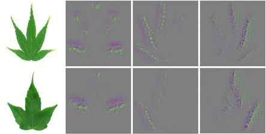

# How Deep Learning Extracts and Learns Leaf Features for Plant Classification

Released on 19 May 2017


## Description

This is the implementation of our PR work with titled [How Deep Learning Extracts and Learns Leaf Features for Plant Classification](http://cs-chan.com/doc/PR2017.pdf). Our preliminary version of this work was presented earlier in ICIP2015 -- [Deep-plant: Plant identification with convolutional neural networks](http://cs-chan.com/doc/150608425v1.pdf). The present works adds to the initial version with novel hybrid global-local feature extraction models:

* Late fusion

* Early fusion (cascade)

* Early fusion (conv-sum)



## Citation 
If you find this code useful for your research, please cite
```sh
@article{Lee20171,
  title={How Deep Learning Extracts and Learns Leaf Features for Plant Classification},
  author={Lee, Sue Han and Chan, Chee Seng and Mayo, Simon J and Remagnino, Paolo},
  journal={Pattern Recognition},
  volume = {71},
  page = {1-13}
  year={2017},
  doi={10.1016/j.patcog.2017.05.015}
  publisher={Elsevier}
}
```

## Dependency

* The codes are based on [Caffe](http://caffe.berkeleyvision.org/)

* Our initial model proposed in [ICIP2015](http://ieeexplore.ieee.org/document/7350839/) was trained and tested on two public leaf datasets - [MalayaKew](http://web.fsktm.um.edu.my/~cschan/downloads_MKLeaf_dataset.html) and [Flavia](http://flavia.sourceforge.net/), while the extension works of hybrid models were trained on a subset of MalayaKew datasets which details are provided in the readme file located at each model's folder.


## Installation and Running

1. Users are required to install [Caffe](https://github.com/BVLC/caffe) Library.

2. Users are required to download the aforementioned leaf datasets for a fair comparison to our proposed models.

3. Please choose one of the options:

Option1:

* All the trained models can be downloaded at [this https URL - URL1](http://web.fsktm.um.edu.my/~cschan/source/PR2017/Model.zip) or alternatively at [this https URL - URL2](http://www.cs-chan.com/source/PR2017/Model.zip). These models include:

	1. Finetuned AlexNet model wrt. whole leaf images (ICIP2015) >> ``` finetune_AlexNet_WL.caffemodel ```

	2. Finetuned AlexNet model wrt. patch based images (ICIP2015) >> ``` finetune_AlexNet_PT.caffemodel ```

	3. Late fusion
 
       * whole leaf images >> ``` finetuneAlex_short_WL.caffemodel ```
  
       * patch based images >> ``` finetuneAlex_short_PT.caffemodel ```

	4. Early fusion (cascade) >> ``` fusionCascade_model.caffemodel ```

	5. Early fusion (conv-sum) >> ``` fusionElit_model.caffemodel ```


Option2:

* New model can trained via ```train_caffenet.sh```. 


Note that users are expected to modify the corresponding files to correct path to work properly. Enjoy!


## Feedback
Suggestions and opinions of this work (both positive and negative) are greatly welcome. Please contact the authors by sending email to
`adeline87lee at gmail.com` or `cs.chan at um.edu.my`.

## Lisense
The project is open source under BSD-3 license (see the ``` LICENSE ``` file). Codes can be used freely only for academic purpose.
