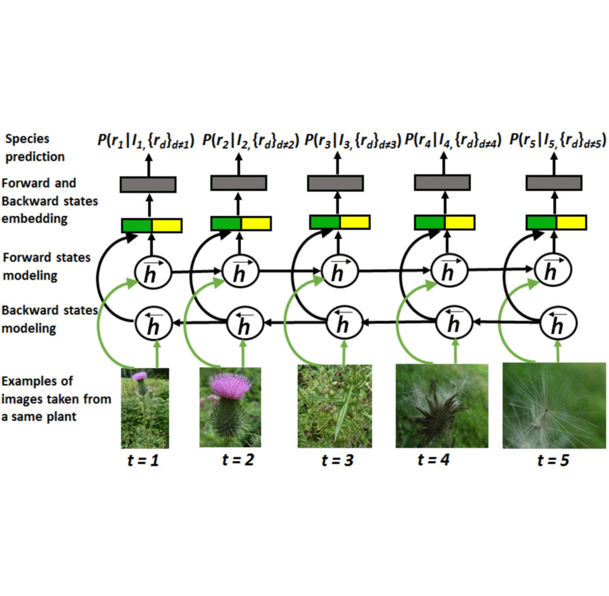

# The Plant-StructNet
Updated on May 28, 2018 - uploaded precomputed fc7 features (for testing)

Released on May 07, 2018.

## Description

This is the implementation of our IEEE Transactions on Image Processing (T-IP) work with titled [Multi-Organ Plant Classification based on Convolutional and Recurrent Neural Networks](https://ieeexplore.ieee.org/document/8359391/).



## Citation 
If you find this code useful for your research, please cite:
```sh
@article{Lee2018,
  title={Multi-Organ Plant Classification based on Convolutional and Recurrent Neural Networks},
  author={Lee, Sue Han and Chan, Chee Seng and Remagnino, Paolo},
  journal={IEEE Transactions on Image Processing},
  volume = {--},
  page = {---}
  year={in Press},
  doi={10.1109/TIP.2018.2836321}
}
```

## Dependency

* The codes are based on [tensorflow](https://www.tensorflow.org/)

## Dataset
* The [PlantClef2015 dataset](http://www.imageclef.org/lifeclef/2015/plant) used has 1000 plant species classes. Training and testing data comprise 91759 and 21446 images respectively.

* All the training and testing images are grouped into their respective observation ID (Tagged in PlantClef2015 dataset). Note that, plant images captured from a same plant are tagged with different mediaIDs but the same observation ID.

* Please download the:

	1. Precomputed fc7 features [here (for training, coming soon)]() and [here (for testing)](http://www.cs-chan.com/source/DeepPlant/conv_fc7_test_256.zip).

	2. Preorganised observationID files ``` obs_mediaID.7z ``` from the Dataset folder. It consists of .mat files that named after plant ObservationIDs. Each .mat file consists of B cell that stores the information of the respective mediaIDs.

	3. Lists of ObservationIDs and ground truth species classes from the Dataset folder:
	* test_obs_list.mat
	* test_obs_class.mat
	* train_obs_list.mat
	* train_obs_class.mat


## Installation and Running

1. Users are required to install [tensorflow](https://www.tensorflow.org/) Library.

2. Users are required to download the necessary files and data according to the aforementioned dataset section for a fair comparison to our proposed models.

3. Users can train the model from scratch by running the main.py which includes ``` temp_createStruct2_2.py ``` and ``` Var_seq2seq_classification_bidirectRNN.py ```.

4. Users can test the trained model prepared in the 'model' folder.


Note that users are expected to modify the corresponding files to correct path to work properly. Enjoy!


## Feedback
Suggestions and opinions of this work (both positive and negative) are greatly welcome. Please contact the authors by sending email to ``` adeline87lee at gmail.com ``` or ``` cs.chan at um.edu.my ```

## Lisense
The project is open source under BSD-3 license (see the ``` LICENSE ``` file). Codes can be used freely only for academic purpose.
